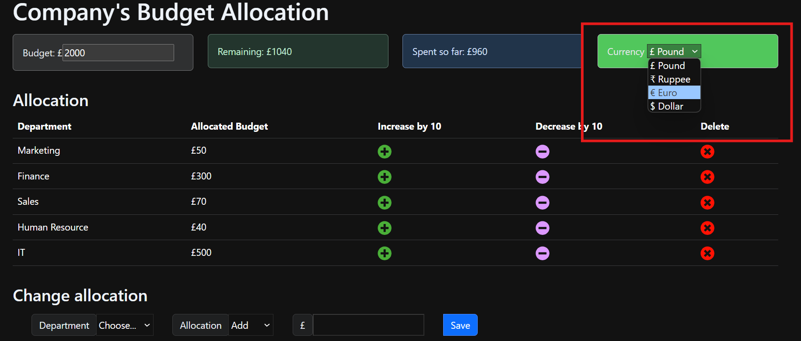

# A Company's Budget App, Using REACT

This is the repository for a Company's budget app. It provides an overview of the project and instructions on how to use it.



## Getting Started

To get started with the React Budget App, follow these steps:

1. Clone the repository to your local machine:

    ```bash
    git clone https://github.com/Bamidele0102/a-company-react_budget_app.git
    ```

2. Navigate to the project directory:

    ```bash
    cd a-company-react_budget_app
    ```

3. Install the dependencies:

    ```bash
    npm install
    ```

4. Start the development server:

    ```bash
    npm start
    ```

5. Open your browser and visit `http://localhost:3000` to access the app.

6. Deployment

 ```bash
        npm run build
```

This will create a `build` directory containing the compiled files. You can deploy this directory to a web server.

## Features

- Track your income and expenses
- Categorize your transactions
- Generate reports and visualizations

## Contributing

Contributions are welcome! If you have any ideas, suggestions, or bug reports, please open an issue or submit a pull request.

## License

This project is licensed under the MIT License. See the [LICENSE](./LICENSE) file for more information.

## Contact

For any inquiries or support, please contact me via [mail](mailto:idowu.olayiwola.bamidele@gmail.com).
